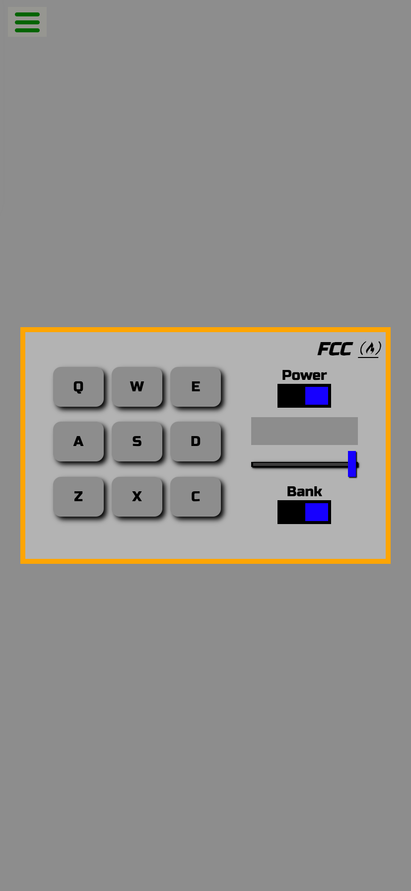
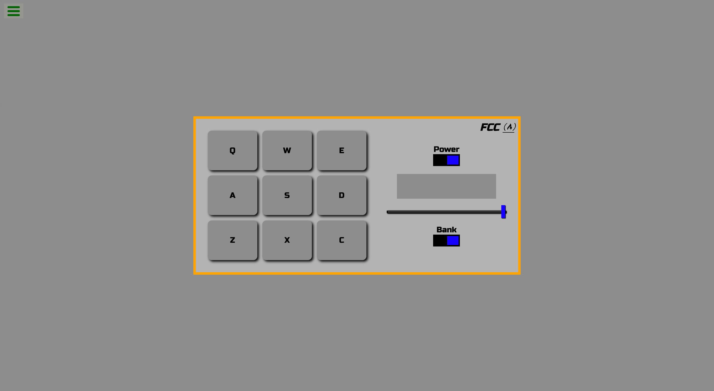

# freeCodeCamp - Build a Drum Machine

This is a solution to the [Build a Drum Machine challenge](https://www.freecodecamp.org/learn/front-end-development-libraries/front-end-development-libraries-projects/build-a-drum-machine) on freeCodeCamp.

## Table of contents

- [Overview](#overview)
  - [The challenge](#the-challenge)
  - [Screenshot](#screenshot)
  - [Links](#links)
- [My process](#my-process)
  - [Built with](#built-with)
  - [What I learned](#what-i-learned)
  - [Continued development](#continued-development)
  - [Useful resources](#useful-resources)
- [Author](#author)

## Overview

### The challenge

Users should be able to:

- View the optimal layout for the site depending on their device's screen size
- Switch power on and off
- Switch "Heater Kit" or "Smooth Piano Kit"
- Adjust volume
- Display user's operation on the screen, such as changing volume and playing clips
- Play clips by mouse or keyboard

### Screenshot

<table>
  <tr>
    <td>
      
    </td>
  </tr>
  <tr>
    <td>
      
    </td>
  </tr>
</table>

### Links

- Live Site URL: [here](https://zun-liang.github.io/fcc-drum-machine/)

## My process

### Built with

- HTML
- CSS
- Flexbox
- Mobile-first workflow
- [React](https://reactjs.org/) - JS library
- [Styled Components](https://styled-components.com/) - For styles
- [Vite](https://vitejs.dev/)

### What I learned

- How to work with audio element
- How to set up media volume
- How to create a volume slider using input[type=range] and apply custom styles
- How to work with keydown event

### Continued development

- Add more features for the drum machine by utilizing HTML media element properties

### Helpful Resources

- [transform-skew](https://developer.mozilla.org/en-US/docs/Web/CSS/transform-function/skew)
- [audio: The Embed Audio element](https://developer.mozilla.org/en-US/docs/Web/HTML/Element/audio)
- [HTMLMediaElement: volume property](https://developer.mozilla.org/en-US/docs/Web/API/HTMLMediaElement/volume)
- [HTMLMediaElement: currentTime property](https://developer.mozilla.org/en-US/docs/Web/API/HTMLMediaElement/currentTime)
- [useRef](https://react.dev/reference/react/useRef)
- [input type="range"](https://developer.mozilla.org/en-US/docs/Web/HTML/Element/input/range)
- [Element: keydown event](https://developer.mozilla.org/en-US/docs/Web/API/Element/keydown_event)
- [KeyboardEvent: code property](https://developer.mozilla.org/en-US/docs/Web/API/KeyboardEvent/code)

## Author

- Website - [Zun Liang](https://zunldev.com/)
- GitHub - [@zun-liang](https://github.com/zun-liang)
- Frontend Mentor - [@zun-liang](https://www.frontendmentor.io/profile/zun-liang)
- freeCodeCamp - [@zun-liang](https://www.freecodecamp.org/zun-liang)
